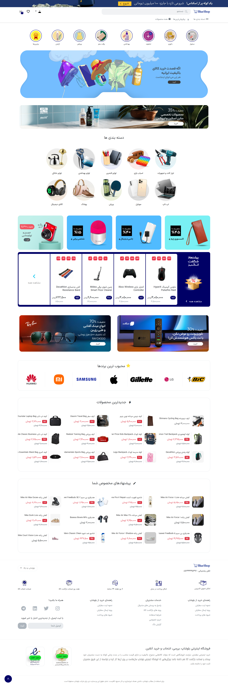
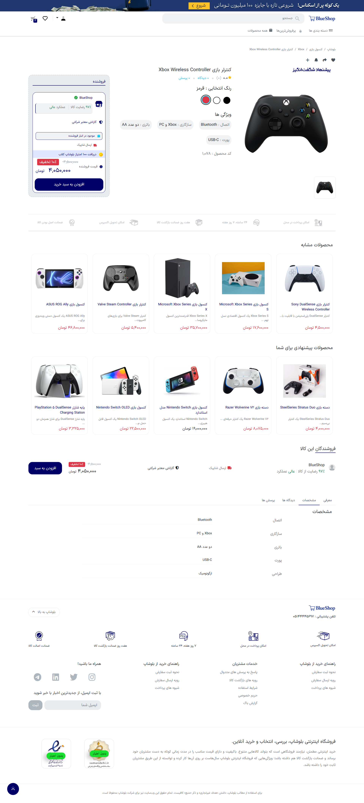
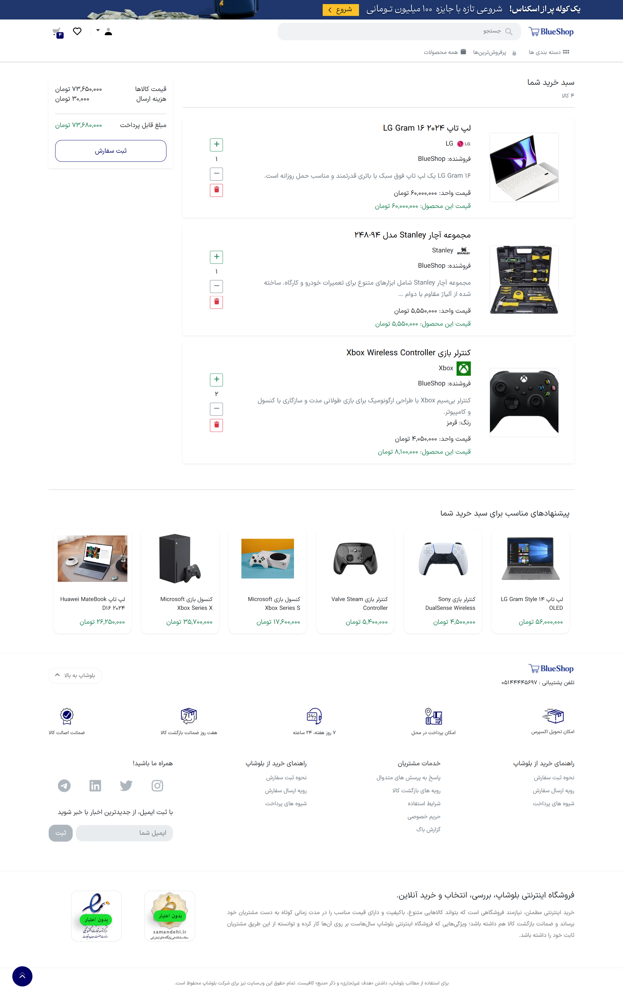
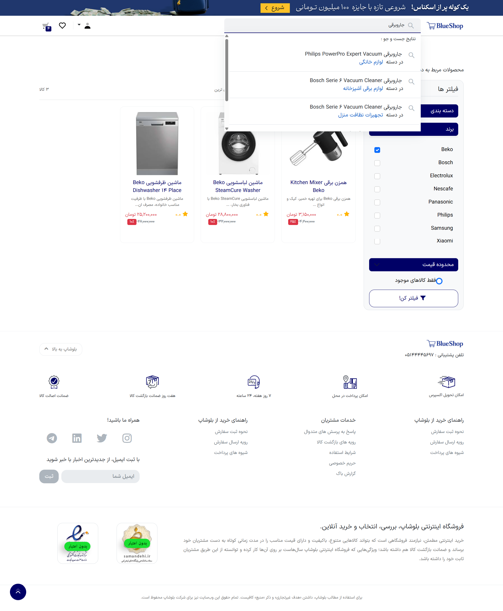

# E-commerce Product Recommender

A Django-based e-commerce platform with a machine learning recommendation system based on user behavior analysis.

## Overview

This project is an e-commerce web application developed with Django, extended with a machine learning-based product recommendation system.

The recommendation system analyzes user interactions with products, including views, wishlist actions, cart additions, and purchases, to generate personalized product recommendations.

## Features

- User authentication and profile management
- Product browsing, search, filtering, and sorting
- Shopping cart and order management
- Product categories and discounts
- Wishlist and saved products
- Personalized product recommendations
- User behavior and interaction tracking
- REST API endpoints
- Responsive custom frontend

## Screenshots

### Home Page



### Product Details



### Shopping Cart



### Search and Filters



## Recommendation System

The recommendation system uses a hybrid approach that combines:
The recommendation system is integrated into multiple parts of the e-commerce platform, including the homepage, product details, and shopping cart, providing personalized product suggestions based on user behavior and product context.

- Collaborative filtering
- Content-based filtering
- User behavior analysis
- User preferences

Different interaction types are assigned different weights based on their relevance, allowing the system to distinguish between browsing and stronger purchase-related signals.

## Tech Stack

- **Backend:** Python, Django
- **Database:** SQLite
- **Machine Learning:** Python, Implicit
- **Frontend:** HTML, CSS, JavaScript
- **API:** Django REST Framework
- **Version Control:** Git

## Project Structure

```text
├── account/
├── api/
├── cart/
├── order/
├── recommendation/
├── SabzShop/
├── shop/
├── static/
├── templates/
├── manage.py
├── erd_data.txt
└── project_structure.txt
